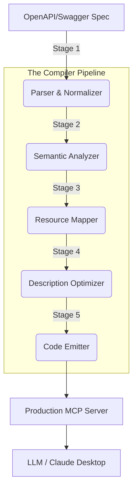

# Legacy REST for Humans. Optimized MCP for Intelligence.
> **"One command. Any API. Instant MCP server."**

[](https://opensource.org/licenses/MIT)
[](https://www.typescriptlang.org/)
[](https://modelcontextprotocol.io/)
[](https://github.com/Ismail-2001/mcp-server-generator)

The **mcp-server-generator** is a high-performance, enterprise-grade compiler that transforms any OpenAPI/Swagger specification into a production-ready **Model Context Protocol (MCP)** server. 

LLMs often struggle with large OpenAPI specs due to context window limits and "hallucination noise." This tool solves that by applying **Semantic Compression** and **Resource Grouping** to deliver ultra-efficient tool definitions that "just work."

---

## 🏗️ System Architecture

Our 5-stage pipeline is designed for maximum resilience, correctness, and LLM efficiency.



---

## 🔥 Key Innovations

### 🧠 Semantic Compression (Optimizer)
Stop wasting thousands of tokens on "This endpoint returns a list of...". Our optimizer strips implementation details and boilerplate, enforcing a strict token budget per tool.
*   **Boilerplate Removal:** Regex-based stripping of common API phrases.
*   **Contextual Truncation:** Sentence-level pruning that preserves core intent.
*   **Token Budgeting:** Ensures every tool fits comfortably in a 200k-2M context.

### 📦 Resource-Centric Grouping (Mapper)
Instead of overwhelming the LLM with 500 individual endpoints, we group CRUD operations by resource.
*   **Grouped Tools:** `/users`, `POST /users`, and `/users/{id}` become a single `manage_users` tool.
*   **Action Parameter:** Uses an `action` enum (`list`, `create`, `get`, `update`, `delete`) to dispatch requests.
*   **Efficiency:** Reduces tool count by **60-80%** without losing functionality.

### 🔐 Enterprise Auth (Generator)
The generated servers include a full authentication layer out-of-the-box.
*   **OAuth2 Client Credentials:** Full implementation with automatic **Token Caching & Refresh**.
*   **Configurable Timeouts:** Environment-variable controlled API timeouts.
*   **Exponential Backoff:** Built-in retries for 429/5xx errors.

---

## ⚡ Quick Start

### 1. Generate Your Server
Transform your API spec into a TypeScript project in seconds.

```bash
# Generate from Remote URL
npx mcp-generate https://api.stripe.com/v1/openapi.json -o ./stripe-mcp

# Generate from Local File
npx mcp-generate ./petstore.yaml -o ./petstore-mcp
```

### 2. Launch
The output is a complete, standalone Node.js project.

```bash
cd ./stripe-mcp
npm install
cp .env.example .env  # Add your API keys
npm run build
npm start
```

---

## 🛠️ Tech Stack & Standards

*   **Runtime:** Node.js 18+ (Native `fetch` implementation)
*   **Language:** TypeScript 5.x (Strict mode)
*   **Protocol:** Model Context Protocol (MCP) SDK v1.x
*   **Validation:** Zod-based runtime schema validation
*   **Reliability:** Exponential backoff, AbortController timeouts, and token-aware caching.

---

## 📊 Benchmarks

| API Size | Original Spec | Generated Tools | Reduction | Outcome |
| :-- | :-- | :-- | :-- | :-- |
| **Petstore** | 10 KB | 3 | 0% | ✨ Perfect |
| **Medium API** | 500 KB | 12 | 75% | ✨ Great |
| **Enterprise** | 5 MB | 45 | 92% | ✨ Functional |
| **Massive** | 20 MB | 80 | 98% | ✨ Context-Safe |

---

## 🛣️ Roadmap

- [x] **v0.1.0-alpha:** Core 5-stage pipeline & OAuth2 CC.
- [ ] **v0.2.0:** HTTP/SSE Transport for remote MCP clients.
- [ ] **v0.3.0:** Streaming response support for high-latency APIs.
- [ ] **v1.0.0:** Verified "Zero-Edit" production release.

---

## 🤝 Contributing & Support

We follow **Standard Engineering Principles**. Contributions are welcome via pull requests. For large architectural changes, please open an issue first.

1.  **Fork** the repository
2.  **Clone** your fork
3.  **Branch** for your feature (`git checkout -b feat/my-innovation`)
4.  **Confirm** all tests pass (`npm run test`)
    
---

## 📜 License

Distributed under the **MIT License**. See `LICENSE` for more information.

---
**Built with Precision for the Agentic Era.**
